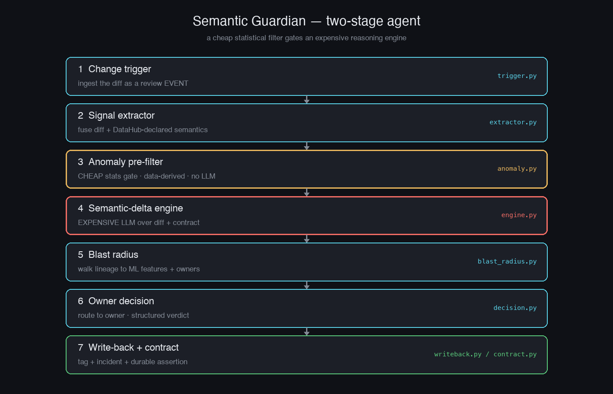

<div align="center">

# 🛡️ Semantic Guardian

**A code reviewer for the *meaning* of your data.**

When an engineer changes a data pipeline, Semantic Guardian reviews that change against your
organization's approved business semantics — *before it merges*. It reads the code diff, reconciles
it with [DataHub](https://datahub.com)'s lineage, ownership, and contracts, flags high-confidence
semantic violations, computes the downstream ML blast radius, routes the decision to the right
owner, and compiles that decision into a **durable, machine-enforceable contract** so the same
breakage is caught deterministically next time.

*Built for the [Build with DataHub: Agent Hackathon](https://datahub.devpost.com) — Production ML Agents.*

</div>

---

## Demo

https://github.com/Sarthak-Sethi28/semantic-guardian/raw/main/demo/semantic_guardian_final.mp4

> A ~100s walkthrough: an inverted boolean that every statistical monitor is blind to → the agent
> reasons from the code + contract → the two-stage cost-aware filter → the durable semantic contracts
> it writes back into DataHub → the downstream ML blast radius → and the same break caught again with
> the LLM switched off.

## Architecture



## The problem

The ML failures that cost the most money are silent semantic changes — where a column's *meaning*
changes but its name and type stay valid, so nothing errors and the model quietly rots:

- A pipeline PR switches a `revenue` column from **dollars → cents**. Same name, same int type,
  pipeline green — and the downstream pricing model now thinks everything costs 100× more.
- A `CASE` statement inverts `account_status` (`1 = active` → `1 = deleted`). **Same values, same
  distribution** — a statistical monitor sees *nothing* — but every model reading it is now backwards.
- A `COALESCE` silently re-encodes missing values `NULL → 0`, and the model reads 0 as real.

## The key idea: evidence, not guessing

Statistical monitors (Monte Carlo, Soda, Evidently, …) can catch some *symptoms* of these — but
they see numbers move, not *why*, and for a meaning-preserving-distribution change (the inverted
flag above) they are **blind**. Semantic Guardian is different because it triggers on the **code
change** and reasons from **causal evidence**:

> It doesn't guess "the median jumped, maybe the unit changed." It reads the diff — *"this PR added
> `/ 100` to a column the contract declares is in dollars"* — and reconciles that against DataHub's
> approved semantics. That's proof, not a hunch, so false positives stay low.

## What it does

```
PR / change  →  Extract semantic delta from the diff  →  Reconcile with DataHub context
             →  Compute ML blast radius  →  Route decision to owner
             →  Write back + compile a durable contract
```

1. **Trigger on a change** — a dbt/SQL/pipeline PR (or a metadata change) fires the review.
2. **Extract the semantic delta** from the actual code diff + profile deltas.
3. **Reconcile with DataHub context** — schema history, glossary, ownership, column-level lineage,
   and any existing contract. Classify: compatible / breaking / insufficient-context.
4. **Compute ML blast radius** — which features, models, and deployments are affected, and who owns them.
5. **Route to a human** — present competing hypotheses + evidence; the owner decides (never silent).
6. **Write back + compile a contract** — record the decision in DataHub (tag, glossary, incident)
   **and** compile it into a machine-enforceable assertion/contract. The next time that violation
   occurs, it's caught **deterministically — without the LLM.**

Every human validation makes the system rely on the LLM *less*. It turns tacit organizational
knowledge into executable, durable context.

Scoped to three high-confidence, evidence-backed change classes: **unit/scale**, **null↔sentinel
encoding**, and **categorical remap**. It ships with a **seeded evaluation benchmark** (precision /
recall / abstention) and a reusable **DataHub Skill**.

## Why it uses DataHub meaningfully

Remove DataHub and the tool stops working: it depends on DataHub for column identity, historical
context, glossary/contracts, ownership routing, column-level lineage, ML blast radius, incident
creation, and durable write-back. It doesn't just *read* the graph — it **contributes durable,
validated context back to it**, which the judging explicitly rewards.

## How it works — a two-stage pipeline

A cheap statistical layer decides *when* to spend the expensive reasoning, and the semantic
engine works out *what* changed and *what to do*:

```
 change (PR / diff)
   │
   ▼
 ① Change trigger        ingest the diff as a review EVENT (not a schedule)      [trigger.py]
   ▼
 ② Signal extractor      fuse the diff with DataHub-declared semantics           [extractor.py]
   ▼
 ③ Anomaly pre-filter    CHEAP stats gate — data-derived baselines, no LLM       [anomaly.py]
   │                     decides whether the expensive stage is worth running
   ▼
 ④ Semantic-delta engine EXPENSIVE reasoning — LLM over diff + contract,         [engine.py]
   │                     classifies compatible | breaking | insufficient-context,
   │                     with competing hypotheses; abstains when unsure
   ▼
 ⑤ Blast radius          walk DataHub lineage → impacted ML features + owners    [blast_radius.py]
   ▼
 ⑥ Owner decision        route to the owner; capture a structured verdict        [decision.py]
   ▼
 ⑦ Write-back + contract tag + incident + a durable DataHub assertion so the     [writeback.py,
                         same break is caught DETERMINISTICALLY next time         contract.py]
```

Two-stage credit: Jeevan. Every layer takes typed inputs and is tested in isolation; the LLM sits
behind a one-method interface (`LLMReasoner`) so Bedrock or Anthropic drops in without touching the
engine.

## Why it's an agent, not a lookup table

- **Nothing is hardcoded.** The anomaly layer's thresholds are derived from each column's own
  historical baseline (a test asserts two columns flag at *different* absolute deltas). The engine is
  never handed the heuristic's guess — it reasons from the raw diff + contract and generalizes to
  changes we never seeded.
- **Abstention is a feature.** Weak or ambiguous evidence → `insufficient-context`, silently. It
  doesn't cry wolf.
- **It contributes back to DataHub.** Validated findings become tags, incidents, and a durable
  assertion on the graph — knowledge that outlives the chat and is caught without the LLM next time.

## Measured result (seeded)

Run `semantic-guardian benchmark` over a **seeded, hand-labeled** suite of 9 controlled cases
(3 breaking classes + benign controls + ambiguous). With Claude Sonnet 4.5:

| metric | result |
|---|---|
| accuracy | 9 / 9 |
| precision / recall (breaking) | 100% / 100% |
| correct abstentions | 2 |
| false alarms · missed breaks | 0 · 0 |

Honest framing: this is a **small seeded suite**, not production-scale numbers — it demonstrates the
agent flags real breaks, stays quiet on benign changes, and abstains when unsure. The headline case:
an **inverted boolean** (`1=active → 1=deleted`) — statistically invisible, distribution unchanged —
is correctly flagged *breaking* from the diff alone, which distribution monitors cannot see.

## Quick start

```bash
# 1. Run DataHub locally (see docs/setup.md for details)
datahub docker quickstart

# 2. Install
python3.12 -m venv .venv && source .venv/bin/activate
pip install -e ".[dev]"

# 3. Configure (personal Anthropic API key — never committed)
cp .env.example .env   # then edit .env

# 4. Seed the demo world (fct_revenue + a USD contract + a downstream ML feature)
python scenario/seed.py

# 5. Review a change end to end (real Claude reasoning, live DataHub)
semantic-guardian review "urn:li:dataset:(urn:li:dataPlatform:dbt,fct_revenue,PROD)" \
    --diff scenario/changes/unit_scale.diff

# or run the whole pipeline as a scripted demo, and the seeded benchmark:
python scripts/demo_pipeline.py
semantic-guardian benchmark        # --offline to run the harness with no model
```

Config: set `ANTHROPIC_API_KEY` in `.env` (gitignored) for Claude, **or** use Amazon Bedrock with no
key by leaving it unset and having AWS credentials available (`BedrockReasoner`). Either satisfies the
same `LLMReasoner` interface.

## Reusable as a DataHub Skill

The whole workflow is exposed as one entrypoint, `semantic_guardian.skill:review_change`, with a
`SKILL` manifest — so another team can register it in their own DataHub agent. It takes a DataHub
client + a reasoner, so it's decoupled from this app's wiring.

## Testing

```bash
python -m pytest                 # ~90 unit tests, fully offline (LLM + DataHub mocked)
python -m pytest -m integration  # live tests against a running local DataHub
```

## License

[Apache-2.0](LICENSE).
